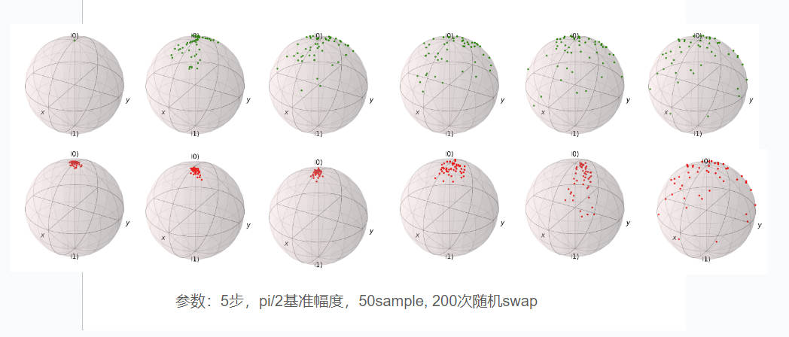
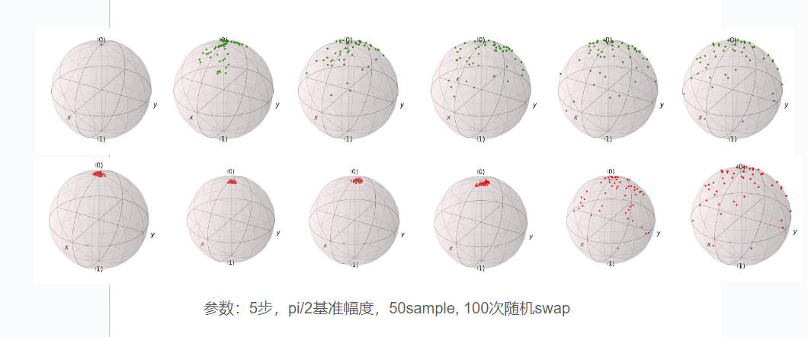
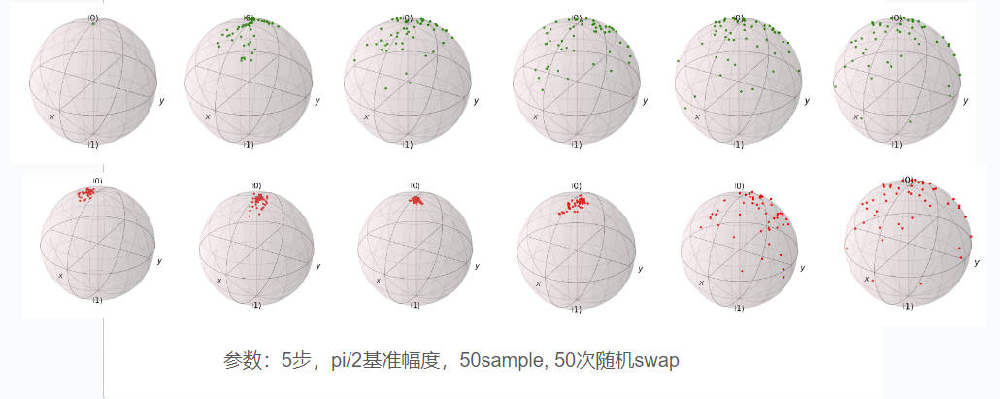
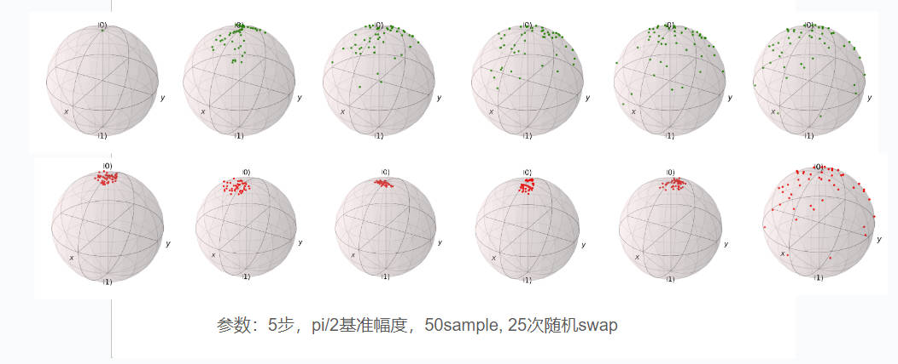
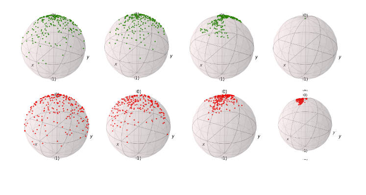

# QuDDPM_reproduce_and_extend
代码是对论文 ：Zhang, Bingzhi, et al. "Generative quantum machine learning via denoising diffusion probabilistic models." arXiv preprint arXiv:2310.05866 (2023).（https://arxiv.org/pdf/2310.05866.pdf ）中单比特散点在布洛赫球上的加噪去噪的复现，具体的原理、公式与量子电路基本架构参见论文。

简单来说，电路每一步的加噪通过对量子比特施加RZ,RY,RZ,RZZ门实现，加噪参数已经预先定义好，去噪引入辅助比特，通过对原比特和辅助比特施加RX,RY,CZ门实现，通过优化参数量子电路，随机在sample里进行两两采样，使得每一步加噪去噪量子态距离尽量接近（实际操作中通过swaptest)实现，以训练出一个通用的量子去噪电路。训练好的去噪电路理论上可以直接输入噪声态对其进行还原。

代码中，初始态选为北极点，加噪步数5步，辅助比特数目n=2，sample数目为50，随机取样次数（训练电路数目）为50.这些均为可调参数，经试验，此组参数去噪效果明显且计算花销不太大。QuDDPM_huayi_1bt.ipynb文件是标准版代码，而QuDDPM_huayi_1bt_NoMsmt.ipynb则通过每次优化不测量辅助比特的方式，减小了电路复杂度和代码运行时间。

部分的加噪去噪结果(绿色从左至右加噪，红色从右至左去噪）：

此外，若选择时间步为3，得到的结果如下（未单独包括在文件夹中）：

更详细的说明与结果展示请见notebook文件。

两比特代码与单比特其他类型去噪的代码正在编写中，将不定期更新。此外，去噪模型与vqe的结合我也在探索中，将持续更新。

系统配置：

显卡：NVIDIA GeForce RTX 3080

处理器：13th Gen Intel(R) Core(TM) i9-13900K   3.00 GHz
